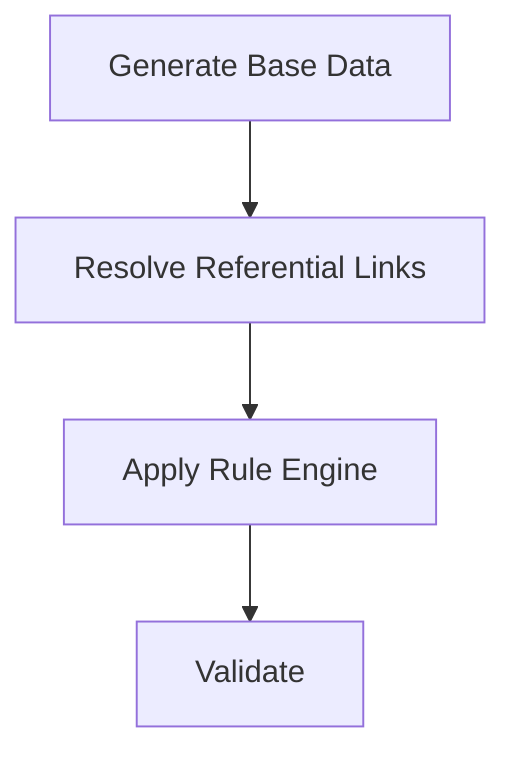
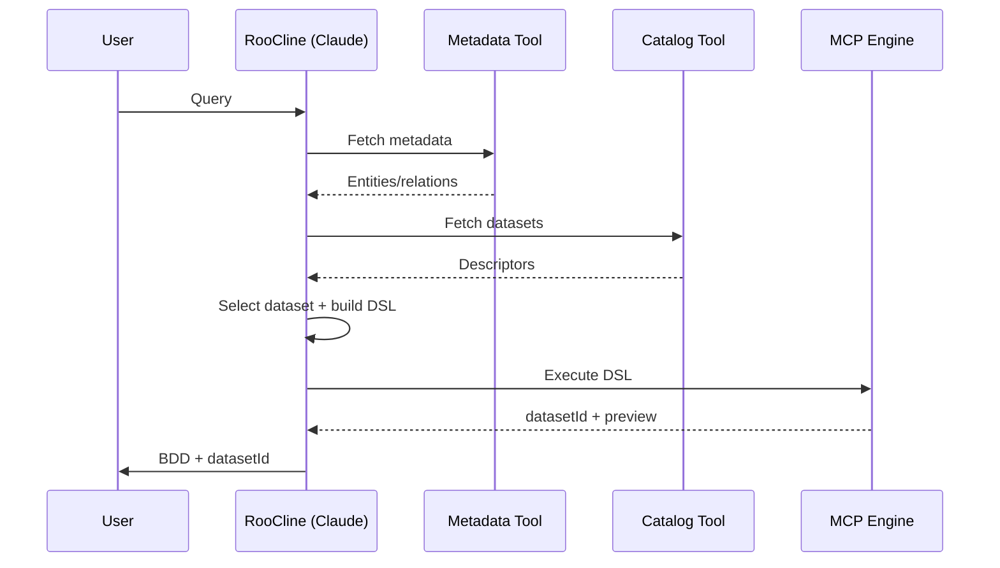

# Synthetic Data Framework — Final Optimized Design (PoC → Scalable)

---

## 0. Scope of This Document

This document consolidates **all final design decisions and optimizations** discussed:

* File-based (no graph DB) PoC
* LLM (Claude via RooCline) as **planner only**
* MCP as **deterministic execution engine**
* Metadata-driven dataset selection (no data in LLM)
* Versioned datasets + transformation DSL
* BDD integration via **dataset references** (not data)

---

# 1. Problem Statement

Build a firm-wide synthetic data framework that:

* Supports **functional, regression, component, and integration testing**
* Works across **100+ applications/domains**
* Maintains **cross-domain referential integrity**
* Generates **reproducible, versioned datasets**
* Avoids **PII leakage**
* Integrates with **BDD test generation and execution**

Constraints for PoC:

* No graph DB (file + in-memory only)
* No large data in LLM context
* Minimal AI usage (planning only)

---

# 2. Core Principles (Non‑Negotiable)

## ✅ DO

* LLM = **Planner / DSL generator**
* MCP = **Executor (data, joins, transforms, validation)**
* Use **metadata + dataset descriptors** for selection
* Use **DAG (topological order)** for generation
* Use **versioned datasets** as reusable assets

## ❌ DO NOT

* Send datasets to LLM
* Let LLM mutate data
* Generate data at test runtime
* Use a single global graph DB in PoC

---

# 3. High-Level Architecture

```mermaid
flowchart TD
    U[User Query] --> R[RooCline (Claude)]
    R --> MT[Metadata Tool]
    MT --> R
    R --> DC[Dataset Catalog Tool]
    DC --> R
    R --> DSL[Transformation DSL]
    DSL --> MCP[MCP Execution Engine]
    MCP --> STORE[(S3 / Local Store)]
    MCP --> PREV[Preview + DatasetId]
    PREV --> R
    R --> BDD[BDD Generation Mode]
    BDD --> TR[Test Runtime Loader]
    TR --> STUB[Stub / DB / Mock]
    STUB --> RUN[Test Execution]
```

---

# 4. Domain Onboarding Input (YAML Contract)

Each domain MUST onboard using a strict YAML contract.

```yaml
domain: payments
version: 1.0
ownership:
  team: payments-team

artifacts:
  entities:
    type: json-schema
    path: bitbucket://repo/path/entities

  apis:
    type: openapi
    path: bitbucket://repo/path/openapi

  rules:
    type: json-rules
    path: bitbucket://repo/path/rules

metadata:
  piiFields:
    - Customer.ssn
    - Customer.phone

  tags:
    - payments
    - financial
```

## Key Simplification

* ❌ No cross-domain mapping in YAML
* ❌ No semantic mapping required from domain
* ✅ Domain only provides schema + lineage (inside schema)

---

# 5. Lineage-Based Dependency Model (Core Design)

## 5.1 Entity JSON Schema with Lineage

Each entity schema MUST include lineage at field level.

```json
{
  "entity": "Account",
  "fields": {
    "cust_ref": {
      "type": "string",
      "lineage": {
        "sourceSystem": "lending",
        "sourceField": "UserProfile.user_uuid",
        "dependencyType": "hard"
      }
    },
    "account_id": {
      "type": "string",
      "lineage": {
        "sourceSystem": "self",
        "dependencyType": "derived"
      }
    }
  }
}
```

---

## 5.2 Dependency Types

| Type    | Meaning                    | Usage                  |
| ------- | -------------------------- | ---------------------- |
| HARD    | Required before generation | Included in DAG        |
| SOFT    | Can be patched later       | Ignored in DAG         |
| DERIVED | Computed field             | Not part of dependency |

---

## 5.3 Key Design Principle

```text
Lineage ≠ Dependency
Dependency = classified subset of lineage
```

---

## 5.4 DAG Construction Logic

Only HARD dependencies are considered.

```java
if (edge.getType() == DependencyType.HARD) {
    graph.addEdge(from, to);
}
```

---

## 5.5 Cycle Problem & Solution

### Problem Example

```
A → B (hard)
B → A (soft)
```

### Resolution

* Build DAG using only HARD edges
* Ignore SOFT edges for ordering

---

## 5.6 Two-Phase Data Generation

### Phase 1: DAG-Based Generation

```
Generate all entities using topological order
```

### Phase 2: Patch Engine (SOFT dependencies)

```java
for (SoftEdge edge : softEdges) {
    patch(targetField, sourceValues);
}
```

---

## 5.7 Cycle Detection (Hard Dependencies Only)

```java
if (hasCycle(hardGraph)) {
    throw new RuntimeException("Invalid hard dependency cycle");
}
```

---

## 5.8 Optional Auto-Resolution

If cycle detected:

```text
1. Identify lowest confidence edge
2. Convert HARD → SOFT
3. Rebuild DAG
```

---

## 5.9 Final Flow with Lineage

```mermaid
flowchart TD
    A[Metadata Ingestion] --> B[Extract Lineage]
    B --> C[Classify Dependencies]
    C --> D[Build DAG (HARD only)]
    D --> E[Topological Sort]
    E --> F[Generate Data]
    F --> G[Patch SOFT Dependencies]
    G --> H[Final Dataset]
```

---

# 6. Derived Rule Engine & Constraint Propagation

## 6.1 Problem

Certain fields (e.g., risk_score) are not directly generated but derived from multiple fields across domains.

Example:

* Account.risk_score depends on:

  * Client.age
  * Suitability.profile

---

## 6.2 Rule Definition (Domain Provided)

```json
{
  "entity": "Account",
  "field": "risk_score",
  "type": "derived",
  "rules": [
    {
      "priority": 1,
      "when": {
        "client.age": "> 60",
        "suitability.profile": "LOW"
      },
      "then": 5
    },
    {
      "priority": 2,
      "when": {
        "client.age": "< 30",
        "suitability.profile": "HIGH"
      },
      "then": 1
    }
  ]
}
```

---

## 6.3 Field Classification

| Type        | Description            |
| ----------- | ---------------------- |
| BASE        | Directly generated     |
| REFERENTIAL | Linked across entities |
| DERIVED     | Computed via rules     |

---

## 6.4 Execution Flow



---

## 6.5 Rule Engine Implementation (Sample)

```java
class RuleEngine {
    int evaluate(Account acc, Client client, Suitability s) {
        if (client.getAge() > 60 && s.getProfile().equals("LOW")) return 5;
        if (client.getAge() < 30 && s.getProfile().equals("HIGH")) return 1;
        return 3;
    }
}
```

---

## 6.6 Constraint Propagation (Reverse Evaluation)

Instead of generating random data:

### Input DSL

```json
{
  "constraints": {
    "Account.risk_score": 5
  }
}
```

### Backward Resolution

```text
risk_score = 5
→ client.age > 60
→ suitability.profile = LOW
```

---

## 6.7 Generation with Constraints

```java
if (targetRisk == 5) {
    client.age = random(61, 90);
    suitability.profile = "LOW";
}
```

---

## 6.8 Rule Dependency Graph

```text
Client → Suitability → Account (risk_score)
```

Ensures correct evaluation order.

---

## 6.9 Conflict Resolution

* Use priority
* First matching rule wins

---

## 6.10 Edge Cases

| Case              | Solution          |
| ----------------- | ----------------- |
| Conflicting rules | Use priority      |
| Missing fields    | Generate defaults |
| Circular rules    | Separate from DAG |

---

## 6.11 Design Principle

```text
Do not generate data randomly and validate
Generate data based on desired rule outcomes
```

---

# 7. RooCline ↔ MCP DSL Contract

All communication between RooCline (Claude) and MCP MUST follow a strict DSL.

## 5.1 Dataset Selection DSL

```json
{
  "action": "select_dataset",
  "domains": ["payments", "lending"],
  "entities": ["Customer", "Payment"],
  "scenario": "failed_payment",
  "filters": {
    "Account.balance": "<100"
  }
}
```

---

## 5.2 Dataset Selection Response (MCP → LLM)

```json
{
  "datasets": [
    {
      "datasetId": "payments_failed_v1",
      "scenario": "failed_payment",
      "tags": ["low_balance"],
      "entities": ["Customer", "Payment"],
      "constraints": {
        "balance": "<100"
      }
    }
  ]
}
```

---

## 5.3 Transformation DSL (LLM → MCP)

```json
{
  "action": "transform_dataset",
  "datasetId": "payments_failed_v1",
  "transformations": [
    {
      "entity": "Account",
      "filter": {
        "Payment.status": "FAILED"
      },
      "update": {
        "Account.balance": -100
      }
    }
  ]
}
```

---

## 5.4 Execution Response (MCP → LLM)

```json
{
  "datasetId": "payments_failed_v2",
  "preview": [
    {
      "customer_id": 1,
      "balance": -100,
      "status": "FAILED"
    }
  ],
  "stats": {
    "rowCount": 10000
  },
  "location": "s3://bucket/payments_failed_v2.json"
}
```

---

## 5.5 Validation Rules for DSL

* Must be valid JSON
* Must conform to schema
* Must not include raw dataset
* Must reference existing entities/fields

---

# 6. Layers & Responsibilities

## 4.1 Metadata Ingestion (Federated)

**Input (per domain):** YAML with paths to entities, APIs, rules

```yaml
domain: payments
artifacts:
  entities: path
  apis: path
  rules: path
```

**Why:** standard contract, domain ownership

**Implementation (Java):**

```java
class MetadataLoader {
  DomainMetadata load(String yamlPath) { return new DomainMetadata(); }
}
```

---

## 4.2 Canonical Model (Normalization)

Normalize all inputs into a **language-agnostic model**.

```java
class Entity { String name; Map<String,String> fields; }
class Relationship { String from; String to; String type; }
```

**Why:** uniform processing across heterogeneous sources

---

## 4.3 In-Memory Graph (DAG)

File-backed + in-memory adjacency list.

```
/graph-store/
  domains/{domain}/entities.json
  domains/{domain}/relationships.json
  global/cross-domain-relationships.json
  global/index.json
```

```java
Map<String, List<String>> graph = new HashMap<>();
```

### Topological Sort (Kahn)

```java
List<String> topoSort(Map<String,List<String>> g) { /* Kahn */ return List.of(); }
```

**Why:** correct generation order, no DB needed

---

## 4.4 Cross-Domain Index (Global Keys)

```json
{
  "Customer.id": ["payments.Customer.id","lending.Customer.id"]
}
```

**Why:** enables deterministic joins across domains

---

## 4.5 Data Generation Engine (Deterministic)

Split generators:

* Seed
* Referential (intra-domain)
* Cross-domain
* PII masking

Use **topological order**:

```
Customer → Account → Transaction → Payment
```

```java
class DataGenerator {
  Map<String,Object> generate(Entity e) { return Map.of(); }
}
```

**Libraries:** Faker, SDV (optional)

---

## 4.6 Dataset Descriptor (Critical)

LLM never sees data—only descriptors.

```json
{
  "datasetId": "payments_failed_v1",
  "scenario": "failed_payment",
  "tags": ["low_balance","failure"],
  "entities": ["Customer","Payment"],
  "constraints": {"balance": "<100"},
  "stats": {"rowCount": 10000}
}
```

**Why:** prevents context bloat; enables selection

---

## 4.7 Dataset Catalog Tool

Returns only descriptors.

```json
{ "datasets": [ { "id":"ds1","scenario":"failed_payment","tags":["low_balance"] } ] }
```

**Why:** LLM selects without data

---

## 4.8 AI Layer (RooCline + Claude) — Planner Only

### Mode A: Intent Parsing

```json
{
  "domains":["payments","lending"],
  "entities":["Customer","Payment"],
  "scenario":"failed_payment",
  "filters":{"Account.balance":"<100"}
}
```

### Mode B: Dataset Selection

Match **scenario + tags + constraints** → datasetId

### Mode C: Transformation Planning (DSL)

```json
{
  "datasetId":"payments_failed_v1",
  "transformations":[
    {"entity":"Account","filter":{"Payment.status":"FAILED"},"update":{"balance":-100}}
  ]
}
```

**Rules:**

* Must output **valid JSON (schema-enforced)**
* No data processing

---

## 4.9 MCP Execution Engine (Deterministic)

**Responsibilities:**

1. Load dataset (S3/local)
2. Apply filters/joins
3. Apply transformations
4. Validate
5. Persist new version

```java
class ExecutionEngine {
  Dataset execute(DSL dsl) { return new Dataset(); }
}
```

**Output:**

```json
{
  "datasetId":"payments_failed_v2",
  "preview":[{"status":"FAILED"}],
  "s3Path":"..."
}
```

---

## 4.10 Validation Layer (Automated)

* JSON Schema
* Constraint rules
* Referential integrity

```java
if(!schemaValid(data)) throw new RuntimeException();
```

---

## 4.11 Storage & Versioning

* S3/local files
* Immutable versions

```
payments_failed_v1
payments_failed_v2
```

**Why:** reproducibility, debugging

---

## 4.12 BDD Generation (RooCline Mode)

```gherkin
Scenario: Failed payment
  Given dataset "payments_failed_v2" is loaded
  When payment is attempted
  Then it should fail
```

**Rule:** reference datasetId only

---

## 4.13 Test Runtime Loader

**Responsibilities:**

* Fetch dataset (S3/local)
* Inject into system

```java
class DataLoader {
  void load(String datasetId) { /* fetch + inject */ }
}
```

**Injection Options:**

* API mocking (WireMock)
* DB seeding
* In-memory stub

---

# 5. Query & Execution Flow



---

# 6. Cross-Domain Join Strategy

* Enforce **global keys** at onboarding
* Build join plan from metadata

```java
join(datasetA, datasetB, "customer_id");
```

**Edge case (cycles):** break via nullable + post-update

---

# 7. Performance & Scaling (PoC-safe)

* Cache DSL results
* Cache dataset descriptors
* Precompute join mappings
* Stateless LLM workers

---

# 8. Open Source Libraries

| Layer       | Library      |
| ----------- | ------------ |
| YAML        | SnakeYAML    |
| JSON Schema | Everit / AJV |
| Graph       | JGraphT      |
| Data Gen    | Faker        |
| Storage     | AWS SDK      |

---

# 9. What NOT to Do (Critical)

* ❌ Send datasets to LLM
* ❌ Let LLM execute logic
* ❌ Skip dataset versioning
* ❌ Merge datasets without keys

---

# 10. Future Enhancements (Out of PoC)

* Graph DB (Neo4j/Neptune)
* Spark/Flink generation
* Embedding-based dataset ranking
* UI for validation
* Dataset lineage tracking

---

# 11. Final Takeaways

* LLM = **Planner (intent → DSL)**
* MCP = **Execution Engine (data)**
* Dataset = **Versioned reusable asset**
* BDD = **Reference to datasetId**
* Runtime = **Consumes dataset, injects stubs**

---

This design ensures:

✔ Scalability to 100+ domains
✔ Deterministic behavior
✔ Zero context overflow
✔ Clean AI + system separation
✔ Reusable and testable datasets

---
